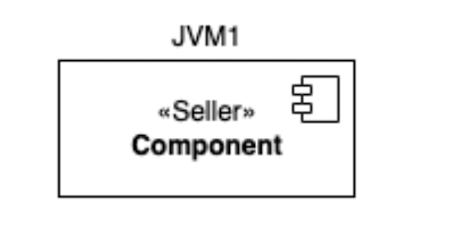

 

    

  <h3 align="center">Implantation d'un système de gestion d'enchères en BCM4JAVA</h3>

  

  UE PSTL
     
  

#### Développé par

Malik Bouaoud

Sandrine Ear

#### Encadrant  
Jacques Malenfant

## 1. Présentation 

Ce projet  porte sur la réalisation d’un système de gestion d’enchères de vente, d’achat de biens ou de services en utilisant des concepts de la programmation par composants en Java et des systèmes répartis avec la bibliothèque BCM4Java.
Ce concept de programmation met l’accent sur la construction d’une application réutilisable grâce aux composants, ce qui va permettre au système d’enchère d’être réutilisable en se greffant sur différents domaines d’application.

## 2. Documentation

La documentation de notre système d'enchère se trouve dans **Auction/Doc**

## 3. Développement 

  ##### 3.1 Protocoles d'enchères 

  les Deux protocoles d'enchères réalisés sont les suivant : un protocol d'enchère à l'offre scélée et un protocole d'enchère à l'anglaise.

  

    
  

  Codé dans le composant **Threshold**.

  

    
  

  Codé dans le composant **EnglishAuction**

  ##### 3.2 Implémentation synchrone 

  Une implémentation synchrone d’un protocole consiste à appeler un enchaînement d’actions dans l’ordre depuis le début de l’enchère jusqu’à sa clôture. Dans le contexte actuel de l’application, une solution synchrone symbolise le fait de dérouler qu’une seule et unique enchère à la fois.

  ##### 3.3 Implémentation asynchrone

  L’introduction du parallélisme dans notre système d'enchères consistait à utiliser des threads dans une architecture centralisée afin que le composant commissaire-priseur puisse être en mesure de gérer correctement plusieurs enchères en même temps.

### 4 Mode d'execution 
### 4.1. MONO JVM
  
  

    
  

Afin de d'executer le projet en mono JVM, il suffit de lancer les deux classes suivantes :

> auctions/src/cvms/CVMEnglishBidding.java

> auctions/src/cvms/CVMThreshold.java

### 4.2. Multi JVM

  

    
    

  
 
Ouvrir 4 terminaux et se placer dans le dossier **auctions/src/dcvms**

#### 4.2.1 Lancer la barière cyclique
> bash start-cb.sh

#### 4.2.2 Lancer le registre global
> bash start-global-register.sh

#### 4.2.3 Lancer les JVMs

> bash  start-dcvm.sh DistributedCVMThreshold.java JVM1

> bash start-dcvm.sh DistributedCVMThreshold.java JVM2

## Remarque
  
  inclure tout les jars dans le **Build path**
